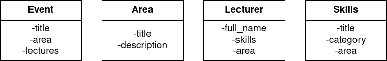

# Django Admin
Simple django-app for showing of admin features.



### run all migrations
```bash
python3 manage.py migrate
```

### create admin
```bash
python3 manage.py createsuperuser
```

### run your application
```bash
python3 manage.py runserver 0:8000
```
